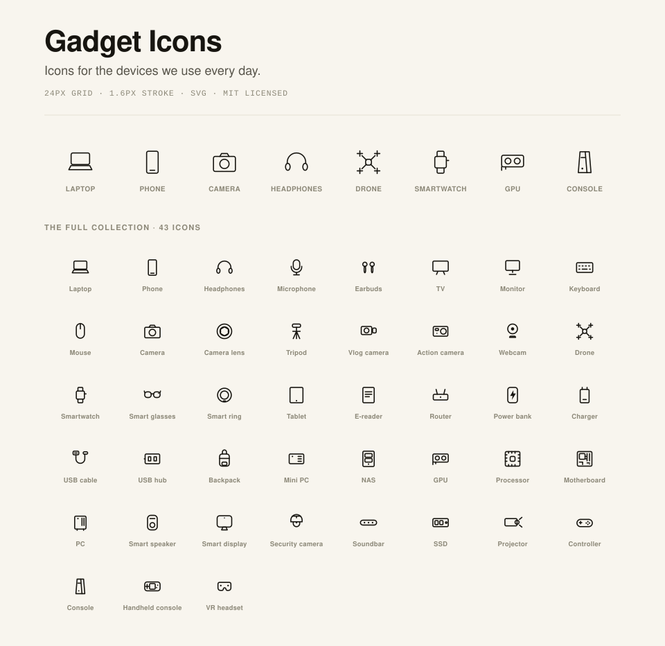

# Gadget Icons

Icons for the devices we use every day.

A focused collection of 47 open-source outline SVG icons for modern gadgets, hardware, cameras, computers, wearables, and smart-home devices.

We originally made these for [thisismynext.in](https://thisismynext.in). Now they are open source for anyone to use.

[Browse and copy every icon](https://jashjacob.github.io/gadget-icons/)



24 × 24 grid · 1.6 px stroke · SVG · MIT licensed

## Installation

Install the package:

```bash
npm install gadget-icons
```

You can also copy any standalone SVG from [`icons/`](icons).

## Basic usage

```html

```

Each SVG uses `stroke="currentColor"` and no fill, apart from a few small details. Inline the markup if you want the icon to inherit text colors, hover states, and dark mode styles:

```html
<a href="/laptop/">
  <svg viewBox="0 0 24 24" width="18" height="18" fill="none" stroke="currentColor" stroke-width="1.6" stroke-linecap="round" stroke-linejoin="round">
    <!-- paste icons/laptop.svg's inner markup here, or fetch it -->
  </svg>
  Laptop
</a>
```

## JavaScript usage

[`icons.mjs`](icons.mjs) contains all the icons and is used to generate the standalone SVG files. It also exports a `svg()` helper and the full `icons` map:

```js
import { svg, names } from 'gadget-icons';

document.querySelector('.icon-slot').innerHTML = svg('laptop', { size: 20 });

names; // every available icon name
```

`svg(name, { size, className, strokeWidth })` throws if the icon does not exist. Check `names` first if the name comes from user input.

## Editor autocomplete

Icon names and options are suggested as you type in supported editors. TypeScript declarations are included in the package, with no extra setup.

```ts
import { svg, type IconName } from 'gadget-icons';

const name: IconName = 'sd-card';
const markup = svg(name, { size: 24, strokeWidth: 1.6 });
```

The gallery lets you search by familiar terms like CPU, hard disk, and memory card. Copied SVGs and downloads use your selected size and stroke. Open an icon's details to copy a JavaScript example or a link to that icon.

## Icons

Every icon name below is also its SVG filename and JavaScript key.

| Category | Icons |
| --- | --- |
| Computing | `laptop`, `monitor`, `keyboard`, `mouse`, `mini-pc`, `nas`, `gpu`, `processor`, `motherboard`, `pc`, `ssd`, `external-hard-drive` |
| Cameras | `camera`, `camera-lens`, `tripod`, `vlog-camera`, `action-camera`, `webcam`, `drone`, `sd-card` |
| Audio | `headphones`, `microphone`, `earbuds`, `smart-speaker`, `soundbar` |
| Mobile and wearables | `phone`, `smartwatch`, `smart-glasses`, `smart-ring`, `tablet`, `e-reader` |
| Smart home | `tv`, `router`, `smart-display`, `security-camera`, `robot-vacuum`, `projector` |
| Gaming | `controller`, `console`, `handheld-console`, `vr-headset` |
| Accessories | `powerbank`, `charger`, `usb-cable`, `usb-hub`, `backpack`, `wireless-charging-stand` |

## Designed as a system

- Recognizable silhouettes over literal detail
- Designed for consistent optical weight
- Details that stay legible at small sizes
- Clean, dependency-free SVGs, styleable with `currentColor`

## Adding an icon

Add an entry to the `icons` object in [`icons.mjs`](icons.mjs), then regenerate the files:

```bash
npm run build
```

This rewrites every file in [`icons/`](icons), updates `preview.svg` and `icons.d.mts`, and refreshes the gallery data in [`docs/`](docs). Do not edit the generated icon files directly because your changes will be overwritten.

## License

MIT. See [LICENSE](LICENSE).
